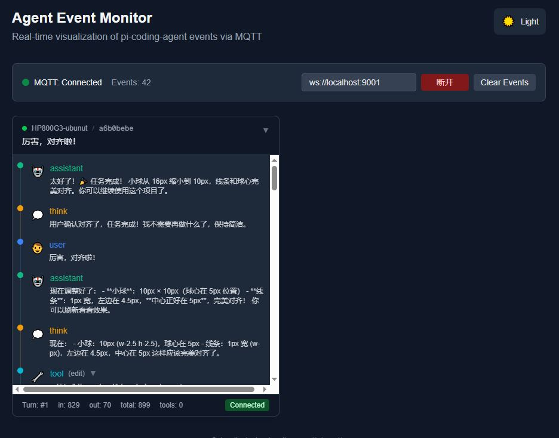

# agent monitor
---

配合 PiCodingAgent + mqtt-monitor.ts(PiAgent的扩展，负责向mqtt发送事件) 扩展的简单网页客户端。

尝试使用 nextjs + reactjs 来实现这个小部件。

## 架构

pi-agent + mqtt-monitor.ts  =(mqtt)=>  mqtt broker =(ws)=> agent-monitor

## 相关材料

[mqtt主题和事件说明文档](https://github.com/wsd1/pi-expansion/blob/main/extensions/mqtt-monitor%E6%8F%92%E4%BB%B6%E4%BD%BF%E7%94%A8%E8%AF%B4%E6%98%8E.md)


## for AI agnet

本项目目标是实现一个 react部件 及 其验证它的一个app辅助框架。该部件使用动画和图形化的方式，渲染Agent通过mqtt传递来的事件流。

该部件是一张卡片，有head, 可以折叠。也有foot，上面可以显示当前token用量之类的信息。
主体部分如下图一样，是一个上下结构时间线。随着事件的进入不停向上翻滚。用户可以向上翻找历史事件。

```
────────────────────────────────
head: user's last comment     +
────────────────────────────────
● session_start
│
● turn_start
│
● message
│
● tool
│
● message
│
● turn_end
────────────────────────────────
foot: in:12 out:1k turns:12
────────────────────────────────
```

本项目除了这个卡片之外，还需要一个辅助验证的背景框架，其内部有四个纵向的槽位，可以摆放卡片，初期只显示一张卡片。同时还需要纳入mqtt逻辑以及中心化数据管理的部件。

## 截图


